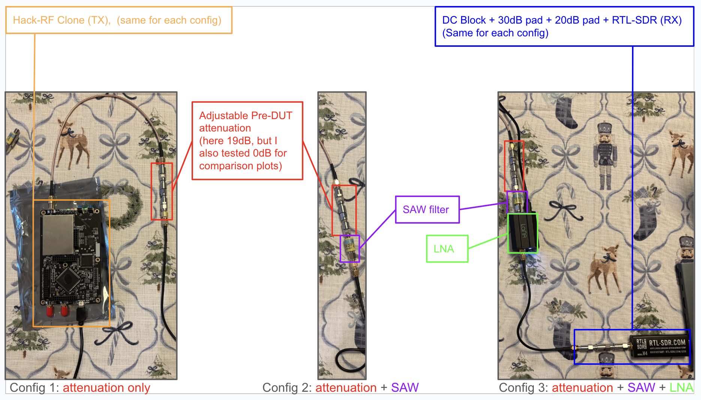
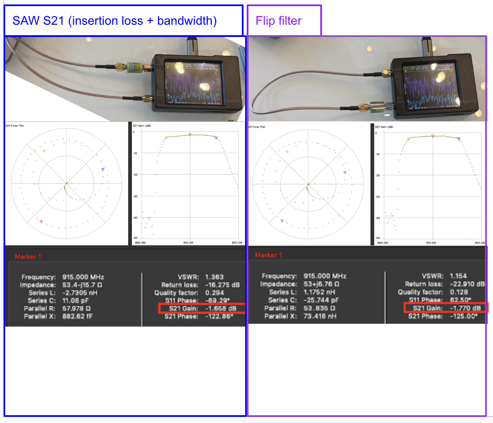
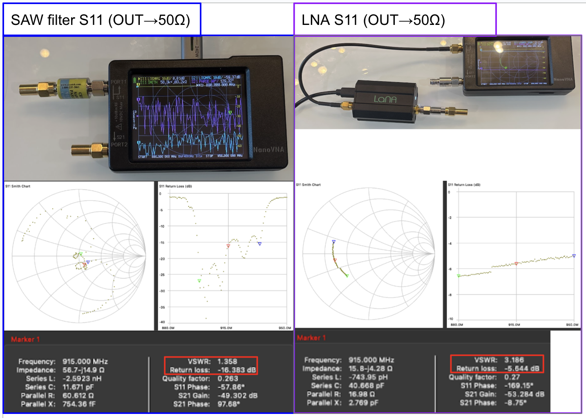
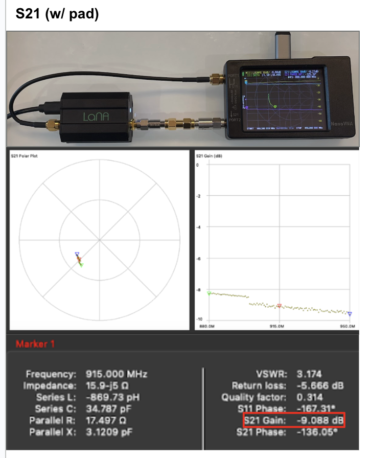
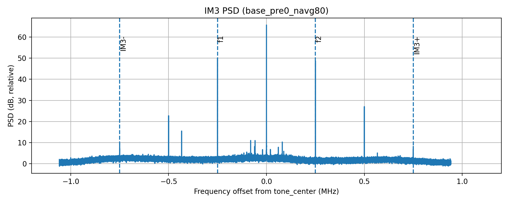
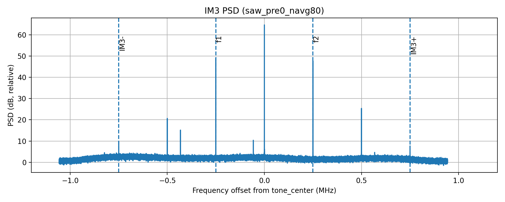
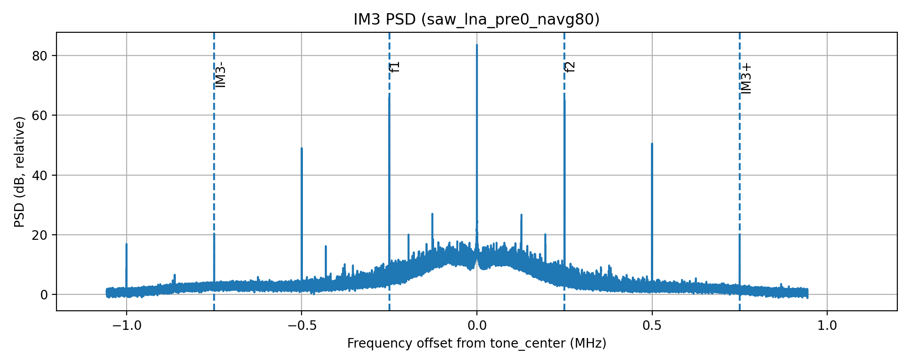
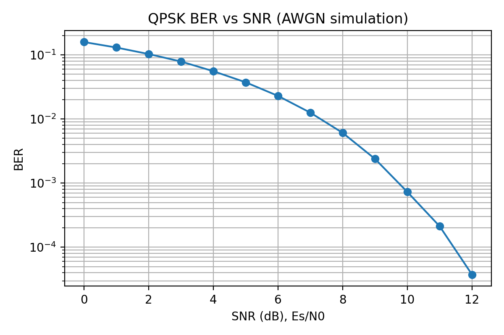
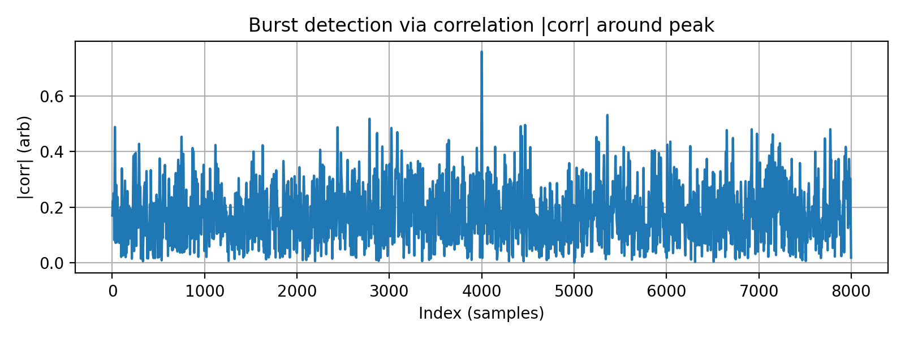
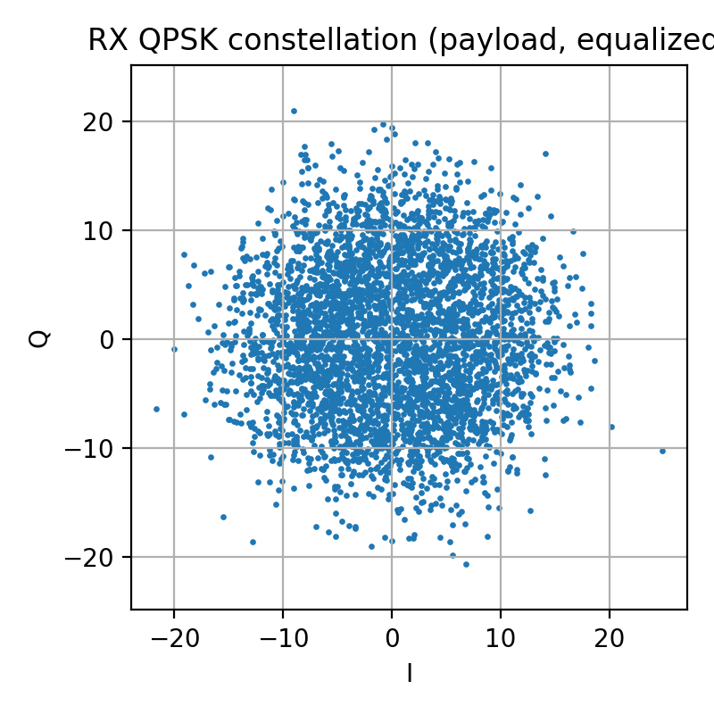

# RF Systems IM3 Testbed @ 915 MHz + SDR Comms Metrics (QPSK)

This repo is a repeatable RF/SDR test setup around the **915 MHz ISM band**. I used it to get practice with:

- **RF front-end tradeoffs + linearity** (two-tone **IM3** / intermodulation spurs)
- **IQ recordings** and basic receiver performance metrics for burst **QPSK** (sync, CFO, channel estimate, EVM, BER)

**Hardware I used:** attenuator pads, **Nooelec LaNA** LNA, HackRF clone (**TX**), RTL-SDR Blog V4 (**RX**), a **915 MHz SAW** bandpass filter, and a **NanoVNA** for quick S-parameter checks.

---

## Contents

- [At-a-glance: what I did](#at-a-glance-what-i-did)
- [Repo layout](#repo-layout)
- [How to reproduce results](#how-to-reproduce-results)
- [Front-end characterization (NanoVNA)](#front-end-characterization-nanovna)
- [Measured results: IM3 (two-tone)](#measured-results-im3-two-tone)
- [Measured results: QPSK comms metrics](#measured-results-qpsk-comms-metrics)
- [Requirements](#requirements)

---

## At-a-glance: what I did

1. **Built an RF chain** at ~915 MHz with swappable parts (pads / SAW / LNA).
2. **Generated a two-tone signal** (HackRF TX) and **recorded IQ** on the RTL-SDR RX.
3. **Made PSD plots** and pulled out **IM3 dBc** from the captured IQ to compare different front-end configs.
4. Wrote a **burst QPSK receiver** pipeline in Python and used it to compute **sync/CFO/channel/EVM/BER** stuff (hardware BER/EVM still not fully validated).

**Experiment setup photo / diagram:**



---

## Repo layout

```text
analysis/                 Python analysis code (IM3, PSD, QPSK helpers)
  analyze_im3.py          Main script for IM3 analysis / plotting
  im3.py                  IM3 helper functions (tone finding, metric extraction)
  psd.py                  PSD / FFT utilities
  rf_io.py                IQ file read/write helpers
  qpsk_*                  QPSK simulation + HW RX metrics scripts

capture/
  capture_rtlsdr.sh       RTL-SDR capture script (writes raw IQ)

data/
  *.bin                   Raw IQ captures
  *_im3.json              Sidecar metadata/results per capture

docs/
  experiment_plan.md      Experiment plan / notes
  img/                    Setup + NanoVNA screenshots used in report
  plots/                  Generated plots (IM3 PSDs, QPSK plots, etc.)

results/
  baseline_hackrf_tx/
    scripts/run_im3_case.sh       Example runner for repeatable IM3 cases
    waveforms/                    Waveforms + generators for HackRF TX
    *_im3.json, *_psd*.png        Example committed outputs
```

---

## How to reproduce results

### 1) Install Python dependencies

```bash
python -m venv .venv
source .venv/bin/activate
pip install -r requirements.txt
```

### 2) IM3: Analyze an existing capture

- IQ + metadata is in `data/`
- Plots get saved to `plots/`
- Main analysis entry point: `analysis/analyze_im3.py`

```bash
python analysis/analyze_im3.py -h
```

> Use `-h` to see CLI options. It takes a capture file and makes PSD plots + IM3 metrics (and/or updates the `*_im3.json` file).

### 3) Capture new RTL-SDR data (hardware required)

```bash
bash capture/capture_rtlsdr.sh
```

## Front-end characterization (NanoVNA)

I used the NanoVNA to sanity-check the **SAW filter insertion loss/selectivity** and the **input match** of the SAW and LNA. This helps interpret the IM3 results because it shows what the RF chain is doing around 915 MHz (loss, match, bandwidth).

### NanoVNA plots used in the report

#### SAW filter S21 (forward + swapped ports)

This is mostly to confirm the SAW acts like a ~915 MHz bandpass filter and to get a rough insertion loss estimate.



**Numbers (from the marker screenshots):**

- SAW S21 @ 915 MHz: **≈ −1.66 dB** (forward) and **≈ −1.77 dB** (swapped)
- ~3 dB-ish passband edges (approx): **897.5–933.9 MHz** (~36.4 MHz BW)
- Stopband example in the sweep shown: ~**−46 to −48 dB** near ~888.4 MHz

**My interpretation:**  
The SAW is passive, so it should be *pretty linear* (it shouldn’t generate IM3 itself). But it **adds insertion loss** (~1.7 dB) and **helps with selectivity**, which can reduce out-of-band junk hitting later stages.

#### SAW + LNA S11 (output terminated to 50 Ω)

These plots are return loss measurements to see how close the input looks to 50 Ω.



**From the marker tables:**

- SAW input match @ 915 MHz (terminated OUT): **S11 ≈ −16.38 dB** (VSWR ≈ 1.36) → decent
- LNA input match @ 915 MHz (terminated OUT): **S11 ≈ −5.64 dB** (VSWR ≈ 3.19) → not great

**My interpretation:**  
The SAW looks reasonably matched, but the LNA input is not close to 50 Ω in this setup. It still works for receiving, but the mismatch can cause reflections/ripples and make results more sensitive to cables/adapters.

#### LNA S21 measured with a 30 dB pad on Port 2

This is mainly “does it have gain and look smooth vs frequency,” but done with a pad so Port 2 isn’t getting blasted.



**Marker number:**

- Measured S21 @ 915 MHz: **≈ −9.09 dB** (includes the pad)

If the pad is **30 dB**, then a rough gain estimate near 915 MHz is:

- **≈ (−9.1 dB + 30 dB) ≈ +21 dB**

**My interpretation:**  
The negative S21 is expected because the attenuator dominates the through measurement. Adding back the pad loss gives a reasonable “about +21 dB” gain estimate.

---

## Measured results: IM3 (two-tone)

### What IM3 is (what the plots are showing)

I transmit **two equal tones** near 915 MHz:

- **f1 = 914.750 MHz**
- **f2 = 915.250 MHz**  
  (so they’re ±250 kHz around 915 MHz, and 500 kHz apart)

A nonlinear system creates 3rd-order products at:

- **2f1 − f2 = 914.250 MHz**
- **2f2 − f1 = 915.750 MHz**

These land **±750 kHz** away from the center. That’s why IM3 is annoying: it falls close to the signals you care about, so it’s hard to filter out.

### How I computed the IM3 number (delta_db / dBc)

For each capture, the analysis:

1. Computes a PSD (FFT) from the received IQ
2. Finds the two main tone peaks near **f1/f2**
3. Finds the IM3 peaks near **914.250 MHz / 915.750 MHz**
4. Computes:

- `delta_db = (tone_level_dB) − (im3_level_dB)`

So roughly:

- **IM3 ≈ −delta_db dBc**

**Bigger `delta_db` is better** (IM3 further down below the tones).

**Settings used for the comparisons below:**  
`navg = 80`, `nfft = 131072`

- `nfft=131072` gives good frequency resolution so tone/IM3 bins are sharp.
- `navg=80` reduces PSD noise/variance so IM3 spikes are easier to spot.
- `*_psd_locked.png` uses consistent axis limits for fair comparisons.

---

### IM3 (dBc) across front-end configurations

#### Summary table

| Configuration | RF Chain (conceptually)          | delta_db (dB) | IM3 (dBc) | What it suggests          |
| ------------- | -------------------------------- | ------------: | --------: | ------------------------- |
| Baseline      | HackRF → pads → RTL              |       40.2929 |    −40.29 | Baseline system IM3 level |
| SAW only      | HackRF → SAW → pads → RTL        |       39.6334 |    −39.63 | Basically same as baseline|
| SAW + LaNA    | HackRF → SAW → LaNA → pads → RTL |       45.2724 |    −45.27 | ~5 dB better (cleaner)    |

#### Baseline (HackRF → pads → RTL), pre0

- `delta_db = 40.2929 dB` (IM3 ≈ **−40.29 dBc**)
- Plot: `plots/base_pre0_navg80_im3_psd_locked.png` 




#### SAW only (HackRF → SAW → pads → RTL), pre0

- `delta_db = 39.6334 dB` (IM3 ≈ **−39.63 dBc**)
- Plot: `plots/saw_pre0_navg80_im3_psd_locked.png`




#### SAW + LaNA (HackRF → SAW → LaNA → pads → RTL), pre0

- `delta_db = 45.2724 dB` (IM3 ≈ **−45.27 dBc**)
- Plot: `plots/saw_lna_pre0_navg80_im3_psd_locked.png`




---

### My take on the IM3 results

**1) SAW-only vs baseline is basically unchanged (~0.7 dB difference).**  
This makes sense because:

- The SAW is **passive and usually very linear**, so it doesn’t generate IM3.
- The tones and IM3 products are **all near 915 MHz**, so the SAW doesn’t strongly attenuate IM3 relative to the tones (they’re in the same passband).

So if IM3 is being created by the **TX**, the **RX**, or something else, the SAW won’t magically remove it.

**2) SAW + LNA looks ~5 dB “better” in this dataset (−45 dBc vs −40 dBc).**  
A ~5 dB increase in `delta_db` means the IM3 spikes are ~5 dB lower *relative to the tones* at the output spectrum. A couple reasons this could happen:

- **Better measurement headroom / SNR:**  
  With more gain up front, the tones are further above the noise, so the spur measurement is less likely to be noise-limited.

- **Gain distribution changes where distortion happens:**  
  Depending on gain settings, the RTL front end can behave differently. An external LNA + padding can sometimes keep the RTL in a nicer operating region.

**3) This is system-level IM3, not a calibrated IP3 measurement.**  
The IM3 spurs could be coming from TX, RX, or both. A real IP3 measurement would sweep input power and check slopes (tone ~1, IM3 ~3) and then extrapolate an intercept.

**What this repo *does* show:**  
If you keep the stimulus and analysis settings fixed, swapping front-end parts changes the spur environment near 915 MHz, and the SAW+LNA setup looked the cleanest in my runs.

---

## Measured results: QPSK comms metrics

This repo also has a QPSK “comms metrics” track where I’m building a burst receiver and extracting debug/performance metrics.

### QPSK BER vs SNR (simulation)

Plot: `plots/qpsk_ber_vs_snr.png` (generated by `analysis/qpsk_sim_ber.py`)



**Why it’s here:**  
This is a sanity check. In AWGN, QPSK BER should drop fast with SNR. I use this as a reference before trusting hardware BER numbers.

### QPSK comms metrics (hardware status)

Hardware capture file (example): `data/qpsk_rx.bin`

What seems to work:

- **Burst correlation lock** (detecting burst start)
- **Coarse CFO estimate** looks reasonable (constellation rotation trend stabilizes)

Debug plots:

- Correlation / lock view: `plots/qpsk_hw_corr.png`
- Constellation view: `plots/qpsk_hw_constellation.png`

Hardware correlation + constellation plots






What I don’t trust yet:

- **EVM and BER** are not reliable right now.

**Why EVM/BER can be wrong even when sync/CFO “look OK”:**  
Burst QPSK is super sensitive to small leftover issues like:

- residual CFO / phase noise (slow constellation rotation)
- symbol timing offset (sampling between symbols)
- scaling / normalization mistakes
- QPSK phase ambiguity (π/2 rotations) or I/Q swap/conjugation
- RRC / matched filter mismatch
- channel estimate applied with wrong alignment or phase

Code location:

- HW receiver script: `analysis/qpsk_hw_rx.py`
- Shared helpers: `analysis/qpsk_lib.py`

**Current takeaway:**  
The front half (sync + coarse CFO) is working and the plots look reasonable. The remaining work is fixing final bit mapping/alignment and normalization so BER/EVM match what the constellation looks like.

---

## Requirements

```bash
pip install -r requirements.txt
```

